# School_District_Analysis
## Module 4: PyCitySchools with Pandas

# Overview of School District Analysis

## Purpose of Asynchronous Analysis
The purpose of the Asynchronous analysis is to help Maria whose job is to analyze standardized tests and student findings. We do this by first cleaning the data provided, merging data frames and calculating key metrics. Once key metrics have been established, further analysis is done by altering key dependent variables in order to reveal trends of math, reading, and average scores for all schools in the district.

## Asynchronous Analysis Overview
The first task that we received in this analysis was to aggregate data and show trends in the data that was provided to us by Maria. Maria believes that a particular data set may be missing data, so we are first tasked with inspecting if there is any missing data, which there is not. The next task is to get key metrics such as total number of students/schools, total budget, subject scores, subject pass percentages, etc. Using these key metrics, we are then tasked with generating a school district summary based on the several key metrics that we previously calculated. Using the school district summary, we are then able to go more in depth and analyze the trends of average reading and math scores by changing the dependent such as schools’ size, amount spent per student, and school types.

## Purpose of Challenge Analysis
In the challenge analysis we are tasked to further analyze the school district analysis, reason being is that Maria believe that the students_complete.csv shows evidence of academic dishonesty specifically for reading and math grades of ninth graders at Thomas High School. Maria would like help re analyzing the school district analysis but this time around without the scores of ninth graders from Thomas High School. After this analysis is done, she would like to have a report showing how this affected the total analysis. 

## Challenge Analysis Overview

First, we are tasked with replacing the reading and math scores of the ninth graders at Thomas High School with `NaN` using the `loc` method with conditional statements and logical operators. Next, Using the same analysis completed in the asynchronous material we will then analyze the trends again but this time without data for ninth graders at Thomas High school.

# Analysis of School District Analysis
 
Now that we have completed the analysis with and without ninth graders from Thomas High School, we can clearly see how the data was affected. 

#### - The district summary was slightly affected in that passing math %, passing reading % and overall passing % all decreased after altering 9th graders scores from Thomas High School. (as seen below)

###### District Summary without altering 9th graders scores at Thomas High School.

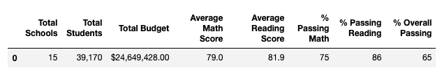 

###### District Summary with altering 9th graders scores at Thomas High School.

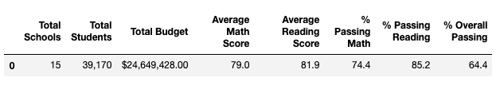 

#### - The school summary was affected for only Thomas High School but not any of the others due to the fact that only scores for ninth graders at Thomas High School were altered but not for any other school. (as seen below)

###### Per School Summary without altering 9th graders scores at Thomas High School.

 

###### Per School Summary with altering 9th graders scores at Thomas High School.

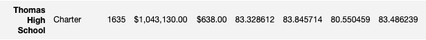 

#### - Replacing the math and reading scores for ninth graders at Thomas Highschool did not affect the total number of students, total school budget or per student budget. While it did slightly affect all the average scores and pass percentages. Relative to other schools it made a significant difference due to the fact that prior to altering the scores, Thomas High School was in the top 5 and after the second analysis it was not. (as seen below)

###### Top 5 Summary without altering 9th graders scores at Thomas High School.

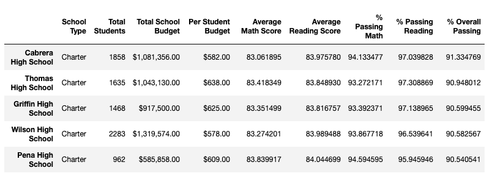 

###### Top 5 Summary with altering 9th graders scores at Thomas High School.

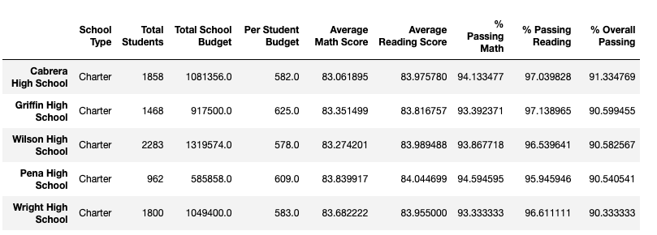 

#### - Math Scores by Grade were only affected for Thomas High school. (as seen below)

###### Math Scores by Grade Summary without altering 9th graders scores at Thomas High School.

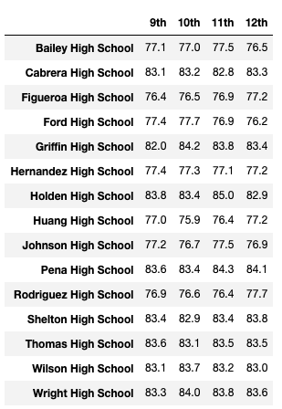 

###### Math Scores by Grade Summary with altering 9th graders scores at Thomas High School.

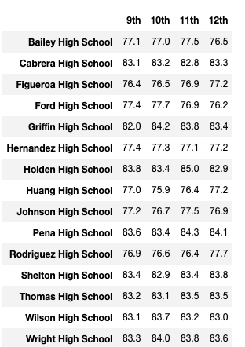 

#### - Reading Scores by Grade were only affected for Thomas High school. (as seen below)

###### Reading Scores by Grade Summary without altering 9th graders scores at Thomas High School.

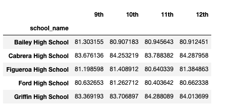 

###### Reading Scores by Grade Summary with altering 9th graders scores at Thomas High School.

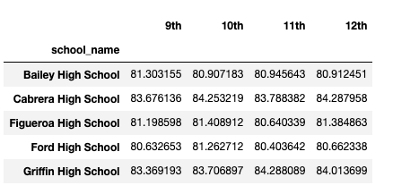 

#### - Scores based on spending ranges was not affected at all. (as seen below)

###### Scores based on spending ranges without altering 9th graders scores at Thomas High School.

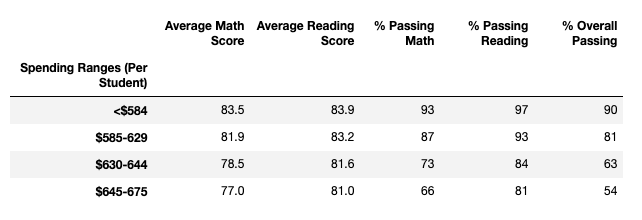 

###### Scores based on spending ranges with altering 9th graders scores at Thomas High School.

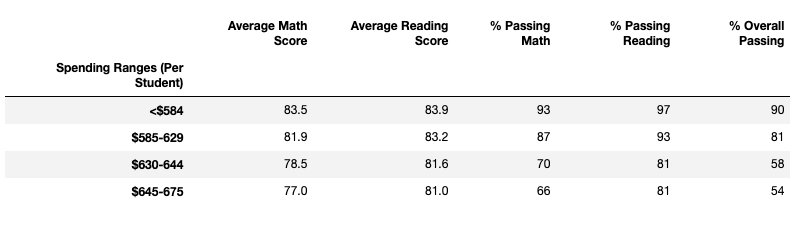 

#### - Scores based on School Size were also not impacted.(as seen below)

###### Scores based on school size without altering 9th graders scores at Thomas High School.

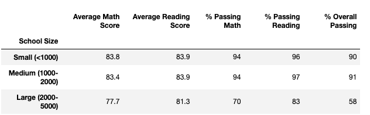 

###### Scores based on school size with altering 9th graders scores at Thomas High School.

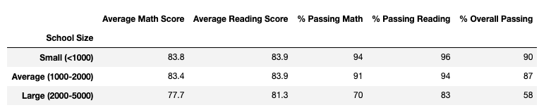 

#### - Scores based on school type were impacted in that there were differences in the passing percentages for charter schools, but district schools remained unaffected. (as seen below)

###### Scores based on school type without altering 9th graders scores at Thomas High School.

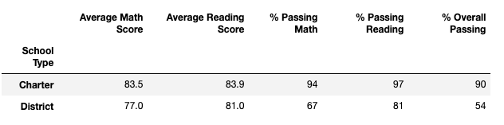 

###### Scores based on school type with altering 9th graders scores at Thomas High School.

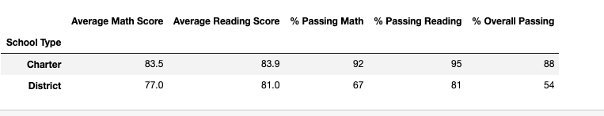 

# Overall Summary

While all of this data may be overwhelming, it is necessary in order to determine whether or not altering those grades on 9th Graders at Thomas High School had a significant impact. After reviewing all of the data, it is clear that these scores have a significant impact. For starters looking at the district summary, it was slightly affected in that passing math % decreased by .6% (75% to 74.4%), passing reading % decreased by .8% (86% to 85.2%), and overall passing % decreased by .6% (65% to 64.4%). Next moving on to school summary for Thomas High School, its shows very clearly that the average math and reading score both decreased and so did the passing percentages for both categories. Finally, it is worth noting that some categories such as scores based on school size and school spending per student were not affected showing that while it did skew most results, it did not skew all. The real significance of all of this comes into play when taking a deeper look at the Top 5 schools, prior to altering the 9th graders scores at Thomas High School, they were placed in the top 5 list at number two, but after the second analysis with the altered grades, they were no longer on that list. Overall, we can see that the altered grades for the 9th graders played a significant role when looking at individual statistics for Thomas High School which was expected but also played a vital role in determining the ranking of the school as a whole which in my opinion was the largest distinguishing factor for the whole analysis.

